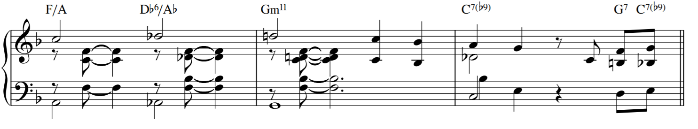

# Automatic Music Transcription (AMT)

Project repo for thesis project on Automatic Music Transcription

## About

This repo contains work completed during an investigation into AMT
as applied to monophonic and polyhonic music using two approaches Non-negative Matrix Factorization of spectrograms and
multi-label classification using Neural Networks

## Built With

- [LibROSA](https://librosa.github.io/librosa/) - Music Analysis Library
- [Keras](https://keras.io/) - Deep Learning library
- [Sklearn](https://scikit-learn.org/) - Machine Learning library
- [mir_eval](https://pypi.org/project/mir_eval/) - Music Information Retrieval Evaluation library

## Authors

- **Oliver Ignetik**

## Acknowledgments

- Dr Parastoo Sadeghi - supervisor
- Dr Rod Kennedy - examiner
